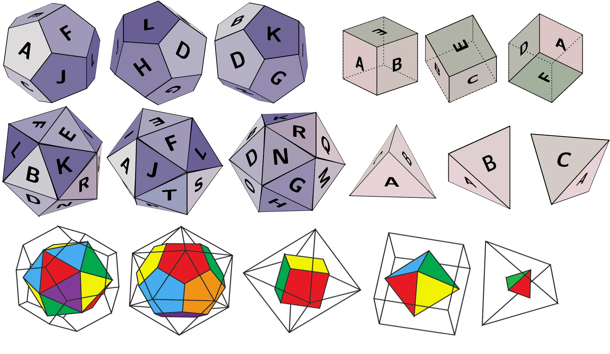

# Edinburgh Maths Year 2 Notes – Semester 2


A cleaned public collection of my personal **Year 2 Mathematics revision notes** for **Semester 2** at the **University of Edinburgh**.

This repository contains LaTeX sources, compiled PDFs, and supporting figures where available. File names have been standardised for public release.

## Courses included

| Course | Folder | Main materials |
|---|---:|---|
| Fundamentals of Pure Mathematics | `FPM/Note/` | Real analysis, proof-based foundations, sequences, functions, and algebraic basics |
| Statistics | `Statistics/Note/` | Probability foundations, distributions, estimation, hypothesis testing, and statistical formulas |

## Preview

The FPM notes include the following supporting figure:



## Repository structure

```text
.
├── FPM/Note/
│   └── figures/
├── Statistics/Note/
├── assets/
├── .gitignore
├── LICENSE
└── README.md
```

## How to use

Read the compiled PDFs directly, or compile the `.tex` files with XeLaTeX.

```bash
xelatex "FPM Note - Jasper Zhou.tex"
xelatex "Statistics Note - Jasper Zhou.tex"
```

## Disclaimer

These are personal study notes and may contain mistakes, omissions, or non-standard explanations. They are **not official University of Edinburgh course materials**. Please use them as supplementary revision material only.

## License

Released under the [MIT License](LICENSE).
